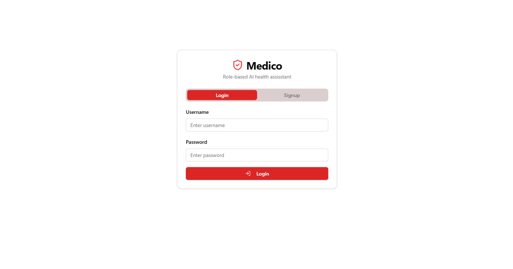
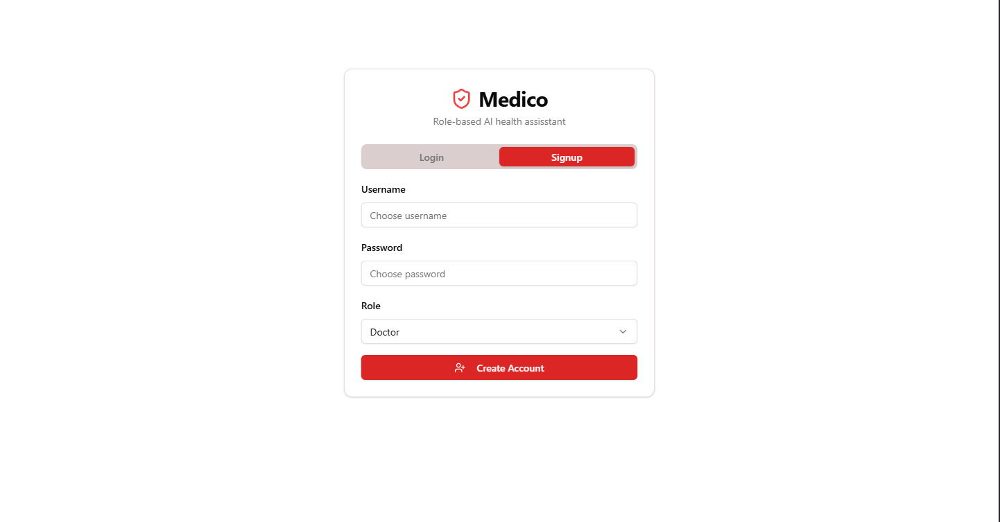
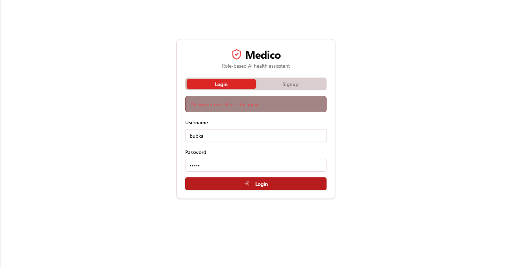
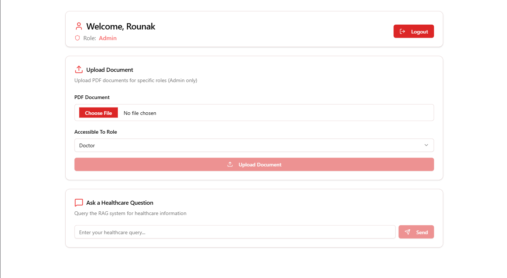
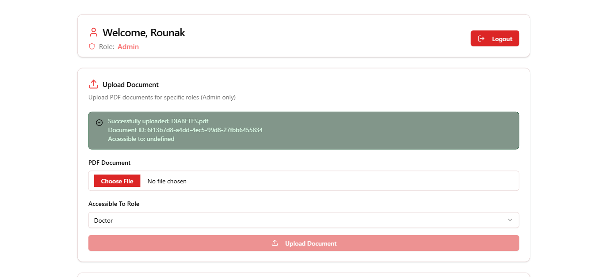
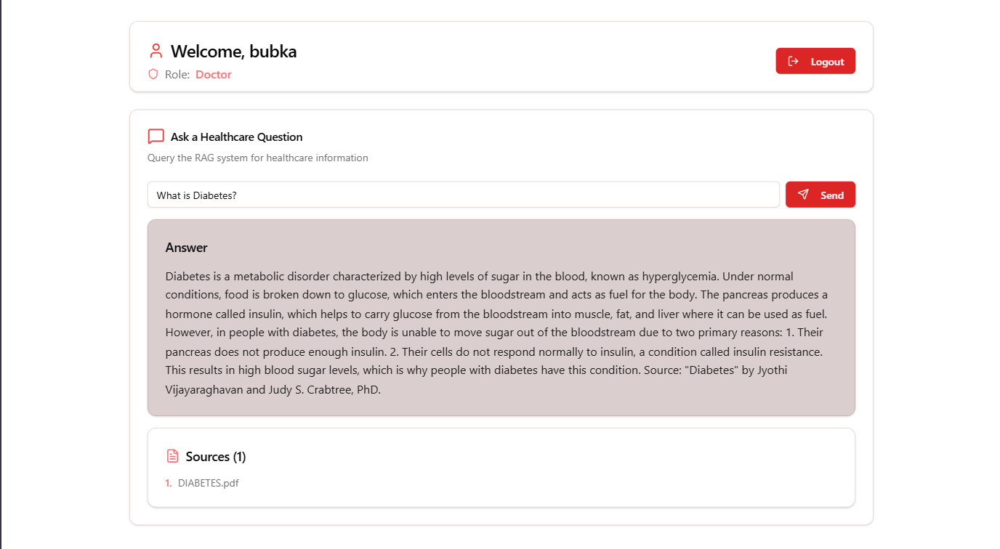
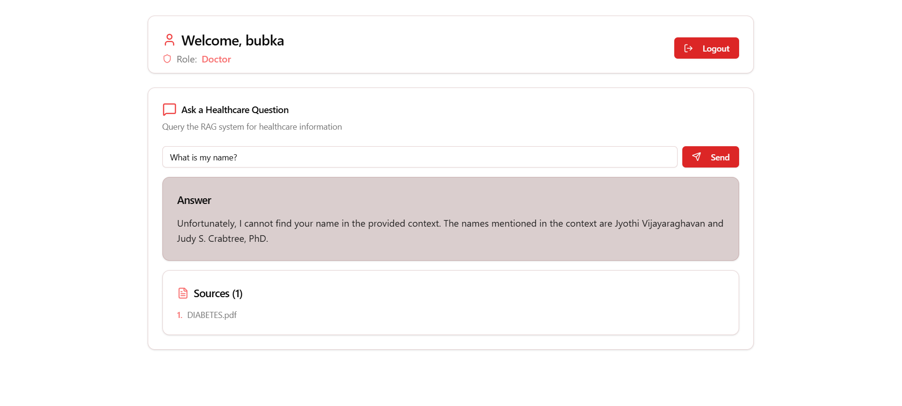

# React + Vite

This template provides a minimal setup to get React working in Vite with HMR and some ESLint rules.

Currently, two official plugins are available:

- [@vitejs/plugin-react](https://github.com/vitejs/vite-plugin-react/blob/main/packages/plugin-react/README.md) uses [Babel](https://babeljs.io/) for Fast Refresh
- [@vitejs/plugin-react-swc](https://github.com/vitejs/vite-plugin-react-swc) uses [SWC](https://swc.rs/) for Fast Refresh

  

## Screens
- SigbIn or SignUp Screen
- Chat Screen
- Document Upload
   
## Backend of the Project: https://github.com/Rounak00/Medico_Server
  
## Quick Glimpses of the site : 

 <table>
  <tr>
    <td>Login </td>
    <td>Signup</td>
  </tr>
<tr>
    <td>Error in login</td>
    <td>Upload Document</td>
  </tr>
<tr>
    <td>Successfull Document Upload</td>
    <td>Chat</td>
  </tr>
  <tr>
    <td>Chat with no context </td>
    <td></td>
  </tr>

 </table>
