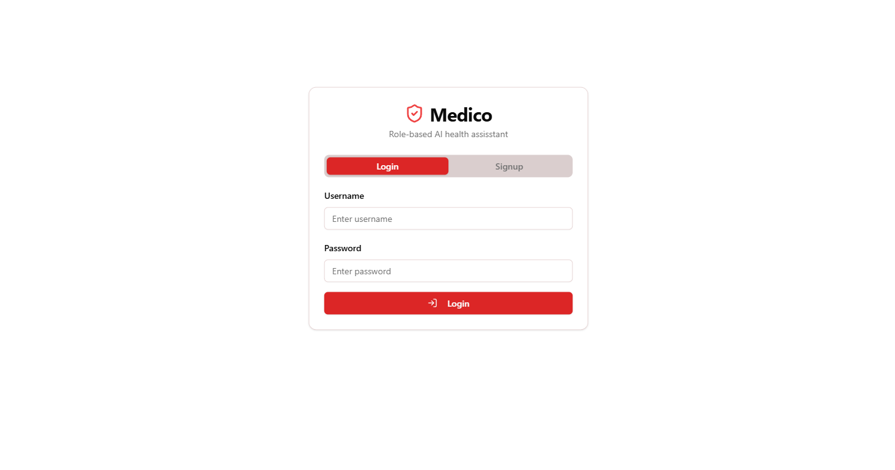
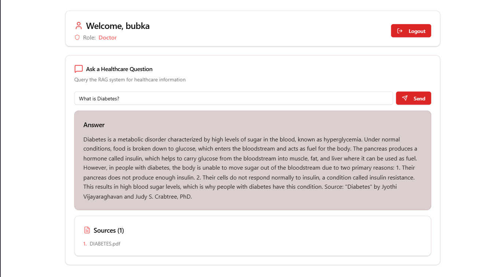
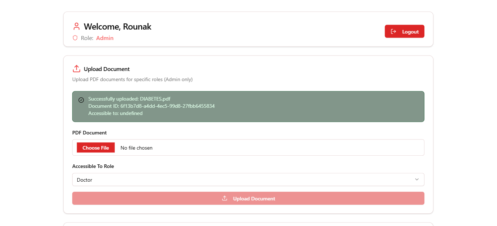
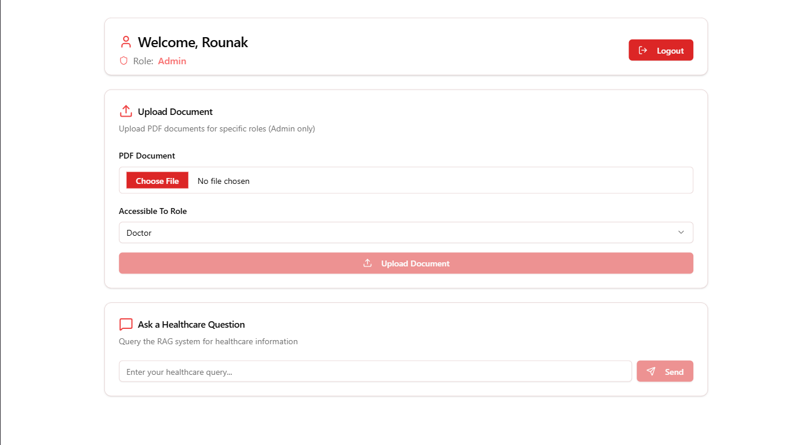

# AI Tool Calling Assessment

## Deployment
**Live Demo:** [https://asymmetri-assessment.vercel.app/](https://asymmetri-assessment.vercel.app/)

---

## Project Overview
This project is a technical assessment for **Asymmetri**. The objective was to build custom tools and integrate them with Generative AI using the **Vercel AI SDK** and **Groq AI**. This allows the AI model to intelligently decide when to call specific functions to retrieve real-time data and return a proper response to the user.

The application is built with **Next.js** (utilizing both SSR and CSR) and utilizes **Drizzle ORM** with **Supabase PostgreSQL** for data persistence.

---

## Implementation Note: Tools Status

During the development, I implemented three distinct tools for the AI agent:

1.  **Weather Tool:** Fully functional. Retrieves real-time weather data.
2.  **Stock Tool:** Fully functional. Retrieves market data.
3.  **Race Tool (F1):**
    *   **Status:** Implementation attempted but currently returning unstable results.
    *   **APIs Attempted:** I integrated **Jolpica**, **Sportmonks**, and **Ergast** APIs.
    *   **Root Cause:** It appears that the APIs are failing to return scheduled data for the current **2025 Season**. As the season data is not yet fully populated in these public endpoints, the tool cannot reliably fetch upcoming race information. I have kept the code implementation to demonstrate the logic, but I am not returning specific results due to the API limitations.

---

## Application Glimpses

<table>
  <tr>
    <td align="center">
        <b>Login Screen</b><br/>
        
    </td>
    <td align="center">
        <b>Chat Interface</b><br/>
        
    </td>
  </tr>
  <tr>
    <td align="center">
        <b>Weather/Stock Tool Result</b><br/>
        
    </td>
    <td align="center">
        <b>Mobile View / Sidebar</b><br/>
        
    </td>
  </tr>
</table>

---

## API Routes

The application exposes the following backend endpoints:

| Route | Method | Description |
| :--- | :--- | :--- |
| **/api/health** | `GET` | Checks server status and verifies database connection health. |
| **/api/chat** | `POST` | The core endpoint. Accepts user messages, manages tool calls (Weather/Stock), and streams the AI response back to the client. |

---

## Tech Stack & Dependencies

This project uses a modern stack focused on performance and type safety.

**Core Framework:**
*   `next`: 14.2.4
*   `react`: ^18
*   `typescript`: ^5

**AI & Tooling:**
*   `ai`: ^4.0.0 (Vercel AI SDK)
*   `@ai-sdk/groq`: ^1.0.0 (LLM Provider)
*   `@ai-sdk/react`: ^0.0.10

**Database & Auth:**
*   `drizzle-orm`: ^0.45.1 (ORM)
*   `postgres`: ^3.4.7 (Supabase Connection)
*   `next-auth`: ^5.0.0-beta.30
*   `@auth/drizzle-adapter`: ^1.11.1

**UI & Styling:**
*   `tailwindcss`: ^3.4.1
*   `framer-motion`: ^12.23.26
*   `lucide-react` & `react-icons`

---

## Environment Variables Structure

To run this project locally, you must create a `.env` file in the root directory and populate it with the following keys:

```bash
# --- Database Configuration (Supabase/PostgreSQL) ---
DATABASE_URL="postgresql://postgres:[PASSWORD]@[HOST]:6543/postgres?pgbouncer=true"

# --- NextAuth Configuration ---
AUTH_SECRET="[YOUR_GENERATED_AUTH_SECRET]"

# --- OAuth Providers ---
# Get these from GitHub Developer Settings
AUTH_GITHUB_ID="[YOUR_GITHUB_ID]"
AUTH_GITHUB_SECRET="[YOUR_GITHUB_SECRET]"

# Get these from Google Cloud Console
AUTH_GOOGLE_ID="[YOUR_GOOGLE_ID]"
AUTH_GOOGLE_SECRET="[YOUR_GOOGLE_SECRET]"

# --- AI & Tool API Keys ---
# Used for the LLM Model (Groq)
GROQ_API_KEY="gsk_[YOUR_KEY]"

# Google Generative AI
GOOGLE_GENERATIVE_AI_API_KEY="AIzaSy..."

# Tools APIs
OPENWEATHER_API_KEY="[YOUR_OPENWEATHER_KEY]"
ALPHAVANTAGE_API_KEY="[YOUR_ALPHAVANTAGE_KEY]"
SPORTMONK_API_KEY="[YOUR_SPORTMONK_KEY]"

## Installation & Local Setup

Follow these steps to run the project locally:

### Prerequisites
- Node.js (v18 or higher)
- npm, yarn, or pnpm
- A Supabase account (or any PostgreSQL database)
- API keys for the services mentioned above

### Steps

1. **Clone the repository**
   ```bash
   git clone <repository-url>
   cd <project-folder>
